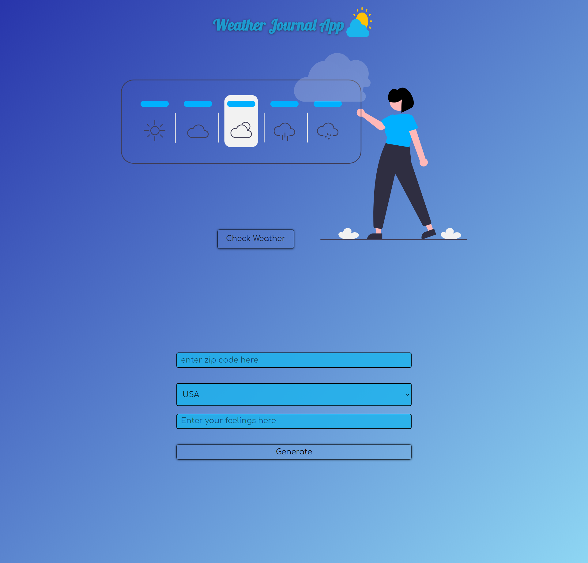

## Weather-Journal App Project

# Overview

This project requires you to create an asynchronous web app that uses Web API and user data to dynamically update the UI.

### Screenshot

you can try it from here:

- Live Site URL: [Click here](https://weather-journal-app-x9ih.onrender.com/)

### Built with

- Semantic HTML5 markup
- CSS custom properties
- Flexbox
- CSS Grid
- javascript
- ES6
- Node js
- Express

## Author

- Frontend Mentor - [@ibrahim11elian](https://www.frontendmentor.io/profile/ibrahim11elian)
- Facebook : (https://www.facebook.com/ibrahim11ahmed/)
- Linkedin : (https://www.linkedin.com/in/ibrahim-ahmed-a8bba9196/)
